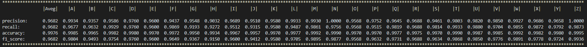

# multiclassify-eval
[TOC]


###Introdution

A simple python module to calculate precision, recall,  accuracy and f-measure for multi-classify evaluation.

一个基于Python的简单的多分类问题评估模块，包含查准率(精确率)、查全率(召回率)、精确度，F1度量。


You can init it by:

你可以通过以下方式初始化：

```python
from evaluation import 
evals = Evaluations(pred,gt,CLASSES)
```

Which `pred`and `gt`  can be a 1-dimension `numpy.ndarray` or `list` range from $[0, N-1]$, $N$ is the length of `CLASSES` . And `CLASSES` is a 1-dimension list contains class labels and `len(CLASSES)=N` must be hold.

`pred`和 `gt` 应该是范围在$[0, N-1]$ 之间的一维`numpy.ndarray`或`list`，即numpy或列表，其中$N$是`CLASSES`的长度。`CLASSES` 是一个包含标签的一维`list`。


After that you can call `evals.average` or `getattr(evals,CLASSES[*])` with `.precision()`, `.recall()`, `.accuracy()`  or `.f1_score()`  to access average or any single class evaluation.

你可以通过下述方法来得到平均的或某个类别的分类情况。

```python
precision_ = evals.average.precision()
recall_ = evals.average.recall()

class_ = getattr(evals,CLASSES[*])
accuracy_ = class_.accuracy()
accuracy_ = class_.f1_score()
```


And you can call `print(evals)`  to see all classes.

你也可以通过`print()`在控制台中显示所有类别的分类情况。



---

### Demo

A simple demo to explain how to use this module in pytorch if you are dealing with a multi classification problem.

如果你在pytorch中实现一个多分类问题，这是一个简单的实例指明如何使用该模块。

```python
from evaluation import *

#Your classes from 'A' to 'Z'
CLASSES = [chr(65 + i_) for i_ in range(26)]

...

#list to put pred & groundtruth labels
pred_list = []
gt_list = []

#some loop to train your data
for i_batch, batch_ in enumerate(dataloader):
  
  ...
  
  #get gt labels
  label = sample_batched['label'].squeeze(-1).to(device)
  gt_list.append(label.detach().cpu().numpy().tolist())
  
  ...
  
  #get pred labels
  pred_ = net(data)
  pred_list.append(pred_.argmax(dim=1).detach().cpu().numpy().tolist())

#transform list to np.ndarray
pred_np = np.array(pred_list)
gt_np = np.array(gt_list)

evals = Evaluations(pred_np,gt_np,CLASSES)

print(evals.average.precision())
print(evals.A.recall())
...

#if you are using tensorboardX in pytorch, you can call this to record data
evals.writelog(writer_test,path='validation',global_step=i_epoch)
```

---

### TensorboardX

if you are using tensorboardX in pytorch, you can call `evals.writelog()` to record data.

如果你在使用tensorboardX，你也可以用通过 `evals.writelog()` to来记录数据。

`    def writelog(self,writer,key='average',path='',global_step = None):`

`writer` should be a summarywriter pre-defined. `key` can be any item in `CLASSES`  ,`'ALL'`  or `'averager'` 

`writer` 应该被预定义好，`key`可以是`CLASSES`中的任意元素，`'ALL'` 或者 `'averager'` 。